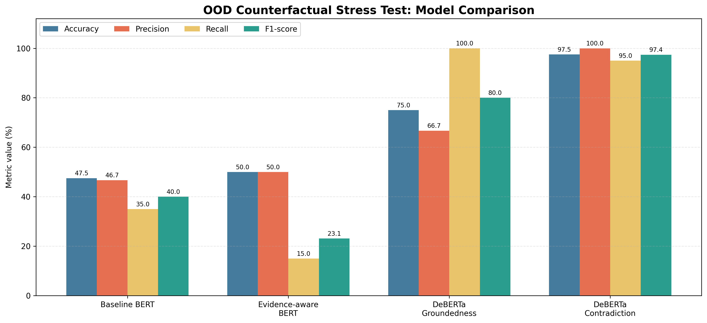

## Research Process and Model Selection

### 1. Dataset analysis and preprocessing

The project began with exploratory data analysis of the LLM Hallucination Benchmark v2 dataset. The original dataset contains questions, reference answers, and responses generated by six language models. Each generated response is labelled as either hallucinated or non-hallucinated.

During EDA, several dataset-specific patterns were identified. In particular, many non-hallucinated responses began with the phrase `Based on verified information:`. Because this phrase was strongly associated with the target label, it could allow a classifier to predict the class without evaluating the factual content of the response. The prefix was therefore removed before model training.

Response length was also found to be associated with the target variable. This suggested that models could learn answer-length shortcuts instead of factual consistency. To reduce leakage between the training and evaluation sets, the data was split by question group, ensuring that responses associated with the same prompt did not appear in different subsets.

### 2. Classical machine-learning models

The first modelling stage evaluated several classical machine-learning algorithms for binary hallucination classification.

TF-IDF was used as a text representation method rather than as a standalone model. Separate TF-IDF vectorizers were fitted to the question and response text. The resulting sparse text features were combined with structured features, including:

* question and response length;
* question type;
* presence of numbers;
* presence of years;
* presence of acronyms;
* presence of scientific terminology.

The categorical `question_type` feature was transformed using one-hot encoding. Class imbalance was handled through class weighting where supported by the selected algorithm.

The following classification models were evaluated:

* Logistic Regression;
* Complement Naive Bayes;
* Linear Support Vector Machine;
* Random Forest;
* XGBoost;
* LightGBM;
* CatBoost.

### Classical Model Comparison

The models were evaluated using five-fold Stratified Group Cross-Validation.

#### Predictive Performance

| Model                  | Accuracy | Precision | Recall | F1     | ROC-AUC |
|------------------------|----------|-----------|--------|--------|---------|
| Logistic Regression    | 0.8035   | 0.5402    | 1.0000 | 0.6933 | 0.9923  |
| Complement Naive Bayes | 0.7471   | 0.4646    | 0.9817 | 0.6284 | 0.8779  |
| Linear SVM             | 0.8258   | 0.5694    | 1.0000 | 0.7183 | 0.9945  |
| Random Forest          | 0.9083   | 0.7446    | 1.0000 | 0.8440 | 1.0000  |
| XGBoost                | 0.9362   | 0.8037    | 1.0000 | 0.8848 | 0.9803  |
| LightGBM               | 0.9649   | 0.8976    | 1.0000 | 0.9396 | 0.9756  |
| CatBoost               | 0.9712   | 0.9091    | 1.0000 | 0.9479 | 0.9841  |

#### Computational Performance

| Model                  | Training Time (s) | Prediction Time (s) |
|------------------------|-------------------|---------------------|
| Logistic Regression    | 15.716            | 0.0080              |
| Complement Naive Bayes | 0.179             | 0.0076              |
| Linear SVM             | 12.373            | 0.0231              |
| Random Forest          | 44.228            | 0.5560              |
| XGBoost                | 4.609             | 0.2927              |
| LightGBM               | 6.234             | 0.2403              |
| CatBoost               | 15.976            | 0.3050              |

CatBoost achieved the strongest overall cross-validation performance, with the highest Accuracy, Precision, and F1-score. However, LightGBM provided a favorable balance between predictive quality and computational efficiency: its training time was approximately 6.2 seconds compared with approximately 16.0 seconds for CatBoost, while the difference in F1-score was relatively small.

Therefore, LightGBM was retained as the strongest classical deployment candidate. This decision was later reconsidered after the external counterfactual evaluation showed that high in-distribution performance did not necessarily indicate reliable factual generalization.

> **Note:** Runtime measurements depend on hardware, software versions, dataset size, and system load. They are included as relative measurements obtained in the same experimental environment.
CatBoost achieved the highest cross-validation Accuracy, Precision, and F1-score. However, LightGBM produced very similar results while requiring substantially less training time. In the measured experiment, LightGBM trained in approximately 6.2 seconds, compared with approximately 16.0 seconds for CatBoost.

LightGBM was therefore selected as the strongest classical deployment candidate based on the balance between predictive performance and computational efficiency. Its hyperparameters were subsequently examined using `RandomizedSearchCV`, although tuning did not produce a meaningful improvement over the original configuration.

Despite their strong internal results, the classical models operated primarily on lexical, structural, and statistical features. They did not explicitly compare an answer with trusted factual evidence. Their high benchmark performance was therefore treated as an internal result rather than proof of real-world hallucination-detection ability. This limitation motivated the subsequent BERT and evidence-grounded NLI experiments.


### 3. Baseline BERT

The next experiment fine-tuned a BERT sequence-classification model using the question and generated answer as a text pair:

`question + answer → hallucination label`

The model was trained on the cleaned dataset, including removal of the dataset-specific response prefix. A group-aware split was used to prevent the same questions from appearing across the training, validation, and test sets.

BERT achieved nearly perfect results on the internal test set. However, an additional counterfactual stress test revealed that the model did not generalize well to deliberately modified factual answers.

On the 40-example out-of-distribution counterfactual test, baseline BERT achieved:

* Accuracy: 47.5%
* Precision: 46.7%
* Recall: 35.0%
* F1-score: 40.0%

The analysis also showed a strong answer-length shortcut. The model predicted hallucination for 65% of short answers but only 10% of long answers. Therefore, its high internal performance was not considered sufficient for deployment.

### 4. Evidence-aware BERT

A second BERT model was developed to include trusted reference evidence:

`question + reference evidence + answer → hallucination label`

The objective was to encourage the model to compare the generated answer with the available ground truth instead of relying only on the form of the answer.

The evidence-aware model was fine-tuned on the original benchmark data after removing the same dataset-specific prefix. It also achieved perfect internal metrics.

On the external counterfactual stress test, its results were:

* Accuracy: 50.0%
* Precision: 50.0%
* Recall: 15.0%
* F1-score: 23.1%

The addition of reference evidence substantially reduced the answer-length shortcut. The predicted hallucination rate for short answers decreased from 65% to 20%, while the rate for long answers remained at 10%.

However, the model detected only 3 of the 20 hallucinated examples. This demonstrated that adding evidence to the input did not automatically make a binary BERT classifier a reliable factual verifier.

### 5. Pretrained NLI DeBERTa

The previous experiments showed that models fine-tuned directly on the benchmark could learn dataset-specific correlations rather than general factual relationships. Therefore, the final experiment changed the task formulation from binary text classification to Natural Language Inference.

The pretrained model `MoritzLaurer/DeBERTa-v3-base-mnli-fever-anli` was used without additional fine-tuning on the project dataset. The model had already been trained on several NLI and fact-verification datasets, including MNLI, FEVER, and ANLI.

Reference evidence was provided as the NLI premise, while the answer was provided as the hypothesis. DeBERTa returned three probabilities:

* `supported` — the evidence entails the answer;
* `unverifiable` — the evidence neither confirms nor directly contradicts the answer;
* `contradicted` — the evidence directly contradicts the answer.

The 40 counterfactual examples were used only as an external stress test. They were not used to train DeBERTa.

Two decision strategies were evaluated.

#### Strict groundedness strategy

Under the strict strategy, both `unverifiable` and `contradicted` answers were classified as hallucinations.

This approach achieved:

* Accuracy: 75.0%
* Precision: 66.7%
* Recall: 100.0%
* F1-score: 80.0%

Although every hallucinated answer was detected, several correct long answers were classified as hallucinations because they contained additional details that were not explicitly covered by the reference evidence.

#### Contradiction-focused strategy

Under the contradiction-focused strategy, only answers classified as `contradicted` were treated as direct hallucinations. `Unverifiable` remained a separate uncertainty status.

This approach achieved:

* Accuracy: 97.5%
* Precision: 100.0%
* Recall: 95.0%
* F1-score: 97.4%

The model correctly classified 39 of the 40 counterfactual examples. The only missed hallucination was a numerical claim stating that water boils at 80°C, while the evidence stated 100°C. The model classified this case as unverifiable rather than contradicted, revealing a remaining limitation in numerical reasoning.

### External Stress-Test Comparison

| Approach                      | Accuracy | Precision | Recall | F1-score |
| ----------------------------- | -------: | --------: | -----: | -------: |
| Baseline BERT                 |    47.5% |     46.7% |  35.0% |    40.0% |
| Evidence-aware BERT           |    50.0% |     50.0% |  15.0% |    23.1% |
| DeBERTa strict groundedness   |    75.0% |     66.7% | 100.0% |    80.0% |
| DeBERTa contradiction-focused |    97.5% |    100.0% |  95.0% |    97.4% |



## Final Deployment Prototype

The contradiction-focused pretrained DeBERTa NLI model was selected as the final deployment prototype.

The final choice was not based only on internal benchmark metrics. The fine-tuned BERT classifiers achieved excellent in-distribution results but demonstrated poor generalization on the external counterfactual test. In contrast, the NLI approach was better aligned with the factual verification task and showed substantially stronger out-of-distribution performance.

DeBERTa was intentionally not fine-tuned on the original benchmark. Further fine-tuning on a dataset containing artificial response patterns could reintroduce the same shortcuts observed in the previous models.

The original dataset remains an essential part of the project. It was used for exploratory analysis, preprocessing, training the classical and BERT baselines, identifying dataset artifacts, and demonstrating the difference between in-distribution performance and real-world generalization.

The final system should therefore be described as an evidence-grounded answer verification prototype rather than a standalone knowledge system. It determines whether an answer is supported, unverifiable, or contradicted relative to the supplied reference evidence.

## Limitations and Future Work

The external counterfactual stress test contains only 40 manually constructed examples. Its results are useful for model comparison and diagnostic analysis, but they are not sufficient to claim production-level performance.

The current prototype also requires reference evidence to be supplied manually. A production-oriented version could include an automatic retrieval component that searches trusted documents, databases, or other approved sources before running the NLI model. This would allow the user to provide only a question and an answer.

Further work should include:

* evaluation on a larger and more diverse out-of-distribution dataset;
* additional testing across different subject areas;
* improved handling of numerical and temporal claims;
* automatic retrieval of trusted reference evidence;
* confidence calibration and threshold selection;
* monitoring of unsupported and unverifiable answers;
* human review for high-risk or ambiguous predictions.

Therefore, DeBERTa should be considered the best-performing deployment candidate among the evaluated approaches, but additional validation is required before production use.


## How to Test the Final DeBERTa Prototype

### 1. Install the Dependencies
Create a virtual environment:

```bash
python -m venv .venv
```

Activate it on macOS or Linux:

```bash
source .venv/bin/activate
```

On Windows:

```bash
.venv\Scripts\activate
```

Install the required packages:

```bash
python -m pip install -r requirements.txt
```

### 2. Run the Interactive Prototype

```bash
python deberta_predict.py
```

The program will request three inputs:

```text
Question:
Answer to check:
Reference evidence:
```

Example:

```text
Question: Who wrote Hamlet?
Answer to check: Charles Dickens wrote Hamlet.
Reference evidence: Hamlet was written by William Shakespeare.
```

Example output:

```text
Status: contradicted
Entailment probability: 0.0%
Neutral probability: 0.2%
Contradiction probability: 99.8%
Groundedness risk: 100.0%
```

The possible statuses are:

- `supported` — the answer is supported by the reference evidence;
- `unverifiable` — the evidence is insufficient to verify the answer;
- `contradicted` — the answer directly contradicts the reference evidence.

The groundedness risk represents the probability that the answer is not fully supported by the provided evidence.

The first execution downloads the pretrained DeBERTa model from Hugging Face. Therefore, an internet connection is required for the first run. Later executions use the locally cached model.

### 3. Run the Automated Tests

```bash
python -m pytest -q
```

The automated tests verify the NLI status selection and the structure of the prediction output.

### Important Limitation

The current prototype does not search for reference information automatically. The user must provide trusted reference evidence together with the answer being checked. Automatic evidence retrieval using a search system or a Retrieval-Augmented Generation (RAG) pipeline is considered future work.
